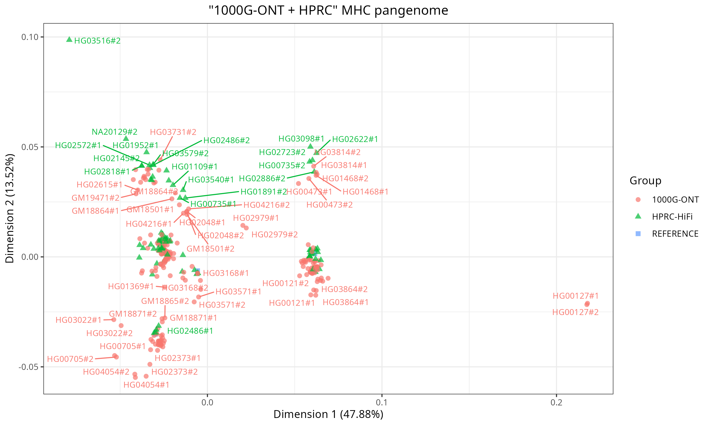
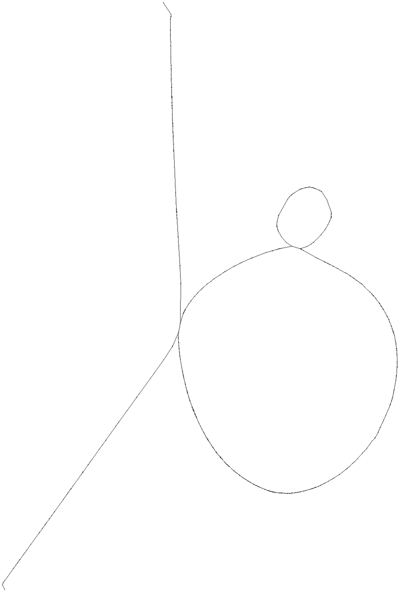
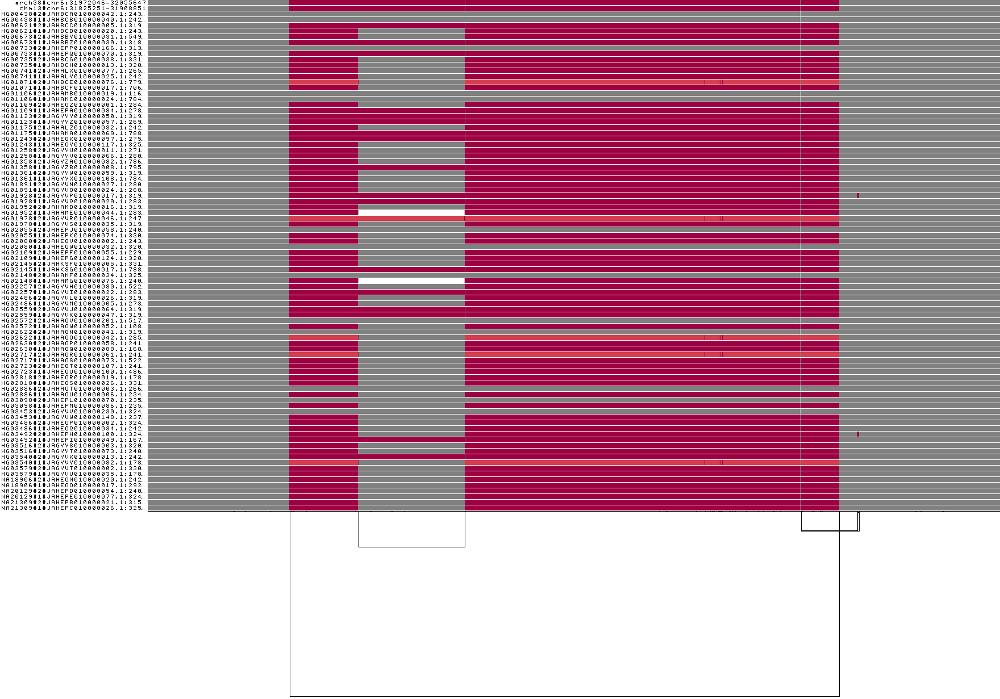

# A few results

## Pangenome graphs

PGGB graphs: [URLs](../data/1000G-ONT-F100-PGGB.gfa.urls.tsv)

## Assembly-based variants

Decomposed VCF files, with variant called w.r.t. GRCh38 and CHM13: [URLs](../data/1000G-ONT-F100-PGGB.vcf.urls.tsv)

## PCA from pangenome graphs made with 1000G-ONT + HPRC assemblies

### chr20

<table>
  <tr>
    <th width="50%">A few labels</th>
    <th width="50%">Labels for reference haplotypes only</th>
  </tr>
  <tr>
    <td width="50%">
      
    </td>
    <td width="50%">
      
    </td>
  </tr>
</table>

### MHC

<table>
  <tr>
    <th width="50%">A few labels</th>
    <th width="50%">Labels for reference haplotypes only</th>
  </tr>
  <tr>
    <td width="50%">
      
    </td>
    <td width="50%">
      
    </td>
  </tr>
</table>

## 1000G-ONT graph vs HPRC-HiFi graph

### C4

Graph layout:

<table>
  <tr>
    <th width="50%">1000G-ONT graph</th>
    <th width="50%">HPRC-HiFi graph</th>
  </tr>
  <tr>
    <td width="50%">
      
    </td>
    <td width="50%">
      
    </td>
  </tr>
</table>

1D "CNV heatmap":

<table>
  <tr>
    <th width="50%">1000G-ONT graph</th>
    <th width="50%">HPRC-HiFi graph</th>
  </tr>
  <tr>
    <td width="50%">
      
    </td>
    <td width="50%">
      
    </td>
  </tr>
</table>
